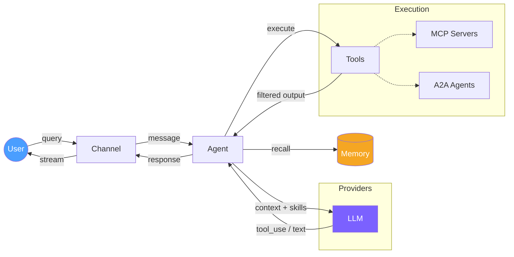
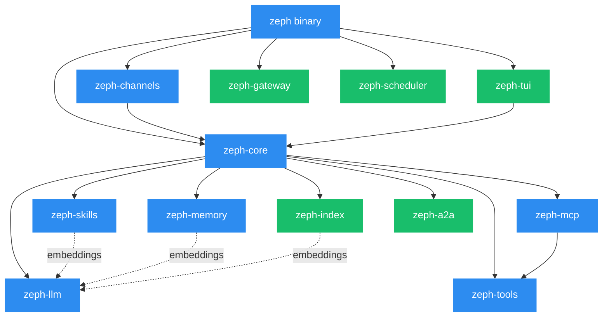

<div align="center">
  

  **AI agent that ships as a single binary. No Python. No containers. No dependency hell.**

  Route tasks across Ollama, Claude, OpenAI, HuggingFace, and any OpenAI-compatible API —<br>
  with semantic skills, vector memory, MCP tooling, and a built-in TUI dashboard.

  [](https://github.com/bug-ops/zeph/actions)
  [](https://codecov.io/gh/bug-ops/zeph)
  [](https://github.com/bug-ops/zeph/security)
  [](https://www.rust-lang.org)
  [](LICENSE)

  [Quick Start](#quick-start) · [Features](#what-makes-zeph-different) · [Docs](https://bug-ops.github.io/zeph/) · [Architecture](#architecture)
</div>

---

## Quick Start

```bash
# From source
git clone https://github.com/bug-ops/zeph && cd zeph
cargo build --release

# With local Ollama
ollama pull mistral:7b && ollama pull qwen3-embedding
./target/release/zeph

# With Claude
ZEPH_LLM_PROVIDER=claude ZEPH_CLAUDE_API_KEY=sk-ant-... ./target/release/zeph

# With OpenAI
ZEPH_LLM_PROVIDER=openai ZEPH_OPENAI_API_KEY=sk-... ./target/release/zeph

# With any OpenAI-compatible API (Together AI, Groq, Fireworks, etc.)
ZEPH_LLM_PROVIDER=compatible ZEPH_COMPATIBLE_BASE_URL=https://api.together.xyz/v1 \
  ZEPH_COMPATIBLE_API_KEY=... ./target/release/zeph
```

Pre-built binaries for Linux, macOS, and Windows: [GitHub Releases](https://github.com/bug-ops/zeph/releases/latest) · [Docker](https://bug-ops.github.io/zeph/guide/docker.html)

## What Makes Zeph Different

### Compiled, Not Interpreted

Written in Rust. Compiles to a single static binary. No runtime, no virtualenv, no `pip install` that breaks on every OS update. Deploy by copying one file.

### Token-Efficient by Design

Most agent frameworks inject every tool into every prompt — O(N) scaling. Zeph embeds skills and MCP tools as vectors, then selects only the **top-K relevant** per query via cosine similarity. Prompt size stays **O(K)** regardless of installed capabilities.

Smart output filtering compresses tool output by **70-99%** before context injection — test results, git logs, clippy diagnostics, directory listings, log deduplication. Per-command stats shown inline:

```
[shell] `cargo test` 342 lines → 28 lines, 91.8% filtered
```

### Hybrid Inference — Local, Cloud, or Both

Run local models via **Ollama** or **Candle** (GGUF with Metal/CUDA acceleration), cloud APIs (**Claude**, **OpenAI**), or any **OpenAI-compatible** endpoint — Together AI, Groq, Fireworks, and more.

The **orchestrator** routes tasks to different providers with automatic fallback chains. The **router** selects models based on prompt content. Use them together for cost-optimized inference that never drops requests.

### Skills, Not Hardcoded Prompts

Capabilities live in `SKILL.md` files — YAML frontmatter + markdown body. Drop a file into `skills/`, and the agent picks it up on the next query via semantic matching. No code changes. No redeployment.

Skills **evolve**: failure detection triggers self-reflection, and the agent generates improved versions — with optional manual approval before activation.

### Memory That Persists

SQLite for conversation history. Qdrant for semantic vector search. Hybrid FTS5 + vector retrieval with configurable ranking weights. Cross-session memory transfers knowledge between conversations with relevance filtering.

Two-tier context pruning: selective tool-output eviction before LLM-based compaction — so the agent calls the LLM less and remembers more.

### Built-In TUI Dashboard

A full terminal UI powered by ratatui — not a separate monitoring tool, but an integrated experience:

- Tree-sitter syntax highlighting and markdown rendering
- Syntax-highlighted diff view for file edits
- Live metrics: token usage, filter savings, cost tracking
- Conversation history with message queueing
- Compact/expanded toggle for tool outputs

```bash
cargo build --release --features tui
./target/release/zeph --tui
```

### Defense-in-Depth Security

Shell sandboxing with path restrictions · file operation sandbox · pattern-based tool permissions (allow/ask/deny) · destructive command confirmation · secret redaction (AWS, OpenAI, Anthropic, Google, GitLab) · SSRF protection (agent + MCP) · audit logging · rate limiting · doom-loop detection · skill trust quarantine with blake3 integrity verification · Trivy-scanned container images with 0 HIGH/CRITICAL CVEs.

### Connect Everything

| Protocol | What It Does |
|----------|-------------|
| **MCP** | Connect external tool servers (stdio + HTTP) with SSRF protection |
| **A2A** | Agent-to-agent communication via JSON-RPC 2.0 with SSE streaming |
| **Channels** | CLI, Telegram, Discord, Slack, TUI — all with streaming support |
| **Gateway** | HTTP webhook ingestion with bearer auth and rate limiting |
| **Native tool_use** | Structured tool calling via Claude and OpenAI APIs; text fallback for local models |

## Architecture

### Agent Loop



### Crate Graph



<sub>Blue = always compiled &nbsp;·&nbsp; Green = feature-gated</sub>

12 crates. Typed errors throughout (`thiserror`). Native async traits (Edition 2024). `rustls` everywhere — no OpenSSL dependency.

> [!IMPORTANT]
> Requires Rust 1.88+. See the full [architecture overview](https://bug-ops.github.io/zeph/architecture/overview.html) and [crate reference](https://bug-ops.github.io/zeph/architecture/crates.html).

## Feature Flags

Always compiled in: `openai`, `compatible`, `orchestrator`, `router`, `self-learning`, `qdrant`, `vault-age`, `mcp`.

| Flag | What It Adds |
|------|-------------|
| `tui` | Terminal dashboard with live metrics |
| `candle` | Local HuggingFace inference (GGUF) |
| `metal` / `cuda` | GPU acceleration (macOS / Linux) |
| `discord` / `slack` | Bot adapters |
| `a2a` | Agent-to-agent protocol |
| `index` | AST-based code indexing |
| `gateway` | HTTP webhook ingestion |
| `daemon` | Component supervisor |
| `scheduler` | Cron-based periodic tasks |
| `otel` | OpenTelemetry OTLP export |
| `full` | Everything above |

```bash
cargo build --release                     # default (always-on features)
cargo build --release --features full     # everything
cargo build --release --features tui      # with dashboard
```

## Documentation

**[bug-ops.github.io/zeph](https://bug-ops.github.io/zeph/)** — installation, configuration, guides, and API reference.

## Contributing

See [CONTRIBUTING.md](CONTRIBUTING.md) for development workflow and guidelines.

## Security

Found a vulnerability? Please use [GitHub Security Advisories](https://github.com/bug-ops/zeph/security/advisories/new) for responsible disclosure.

## License

[MIT](LICENSE)
