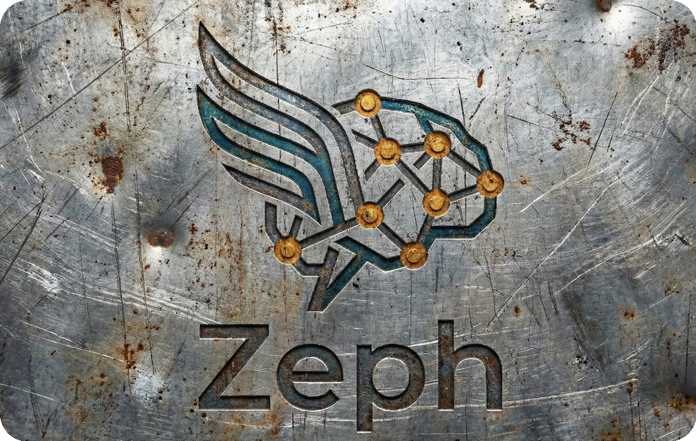
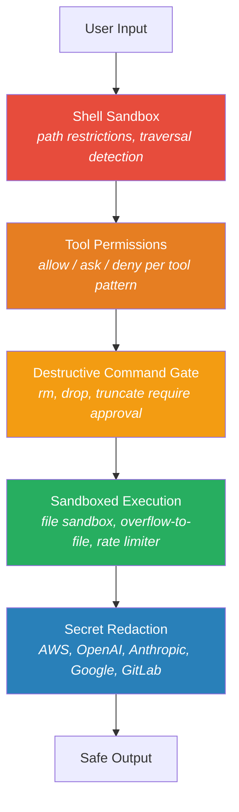
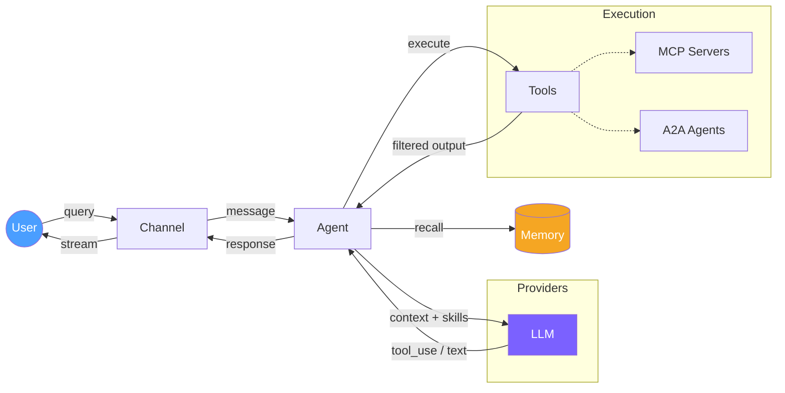
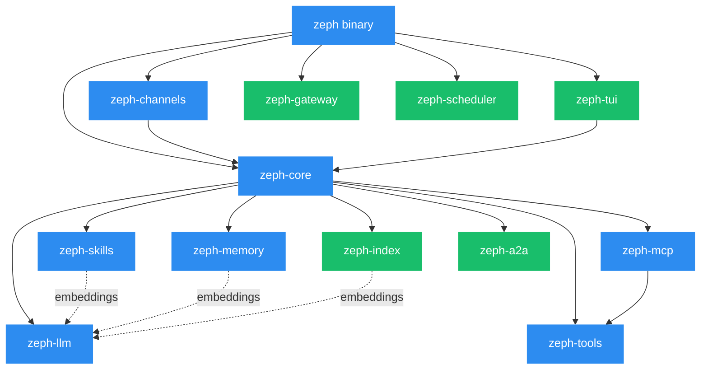

<div align="center">
  

  **The AI agent that respects your resources.**

  Single binary. Minimal hardware. Maximum context efficiency.<br>
  Every token counts — Zeph makes sure none are wasted.

  [](https://crates.io/crates/zeph)
  [](https://docs.rs/zeph)
  [](https://github.com/bug-ops/zeph/actions)
  [](https://codecov.io/gh/bug-ops/zeph)
  [](https://github.com/bug-ops/zeph/security)
  [](https://www.rust-lang.org)
  [](LICENSE)

  [Quick Start](#quick-start) · [Efficiency](#automated-context-engineering) · [Security](#defense-in-depth-security) · [Docs](https://bug-ops.github.io/zeph/) · [Architecture](#architecture)
</div>

---

## The Problem

Most AI agent frameworks are **token furnaces**. They dump every tool description, every skill, every raw command output into the context window — and bill you for it. They need beefy servers, Python runtimes, container orchestrators, and a generous API budget just to get started.

Zeph takes the opposite approach: **automated context engineering**. Only relevant data enters the context. Everything else is filtered, compressed, or retrieved on demand. The result — dramatically lower costs, faster responses, and an agent that runs on hardware you already have.

## Installation

> [!TIP]
> ```bash
> curl -fsSL https://github.com/bug-ops/zeph/releases/latest/download/install.sh | sh
> ```

<details>
<summary>Other installation methods</summary>

```bash
# From source
cargo install --git https://github.com/bug-ops/zeph

# Docker
docker pull ghcr.io/bug-ops/zeph:latest
```

Pre-built binaries for Linux, macOS, and Windows: [GitHub Releases](https://github.com/bug-ops/zeph/releases/latest) · [Docker](https://bug-ops.github.io/zeph/guide/docker.html)

</details>

## Quick Start

```bash
# Interactive setup wizard — configures vault backend, provider, memory, and channel settings
zeph init

# Run the agent
zeph

# Or with TUI dashboard (requires `tui` feature)
zeph --tui
```

Manual configuration is also supported:

```bash
# Local models — no API costs
ollama pull mistral:7b && ollama pull qwen3-embedding
zeph

# Cloud providers
ZEPH_LLM_PROVIDER=claude ZEPH_CLAUDE_API_KEY=sk-ant-... zeph
ZEPH_LLM_PROVIDER=openai ZEPH_OPENAI_API_KEY=sk-... zeph

# Multi-model routing — primary Claude, fallback Ollama
ZEPH_LLM_PROVIDER=orchestrator zeph  # configure via `zeph init`

# Any OpenAI-compatible API (Together AI, Groq, Fireworks, etc.)
ZEPH_LLM_PROVIDER=compatible ZEPH_COMPATIBLE_BASE_URL=https://api.together.xyz/v1 \
  ZEPH_COMPATIBLE_API_KEY=... zeph
```

> [!TIP]
> Full setup walkthrough: [Installation](https://bug-ops.github.io/zeph/getting-started/installation.html) · [Configuration](https://bug-ops.github.io/zeph/getting-started/configuration.html) · [Secrets management](https://bug-ops.github.io/zeph/guide/vault.html)

## CLI Usage

```
zeph                     Run the agent (default)
zeph init                Interactive configuration wizard
zeph init -o path.toml   Write generated config to a specific path
zeph --tui               Run with TUI dashboard
zeph --daemon            Run as headless background daemon with A2A endpoint
zeph --connect <url>     Connect TUI to a running daemon via SSE
zeph --config <path>     Use a custom config file
zeph --vault <backend>   Secrets backend: env or age
zeph --vault-key <path>  Path to age identity key file
zeph --vault-path <path> Path to age-encrypted vault file
zeph --version           Print version
zeph --help              Show help

zeph vault init          Generate age keypair and empty encrypted vault
zeph vault set KEY VAL   Encrypt and store a secret
zeph vault get KEY       Decrypt and print a secret value
zeph vault list          List stored secret keys (no values)
zeph vault rm KEY        Remove a secret from the vault

zeph skill install <path|url>  Install an external skill
zeph skill remove <name>       Remove an installed skill
zeph skill list                List installed skills
zeph skill verify              Verify integrity of installed skills
zeph skill trust <name>        Mark a skill as trusted
zeph skill block <name>        Block a skill from execution
zeph skill unblock <name>      Unblock a previously blocked skill

# Custom skill secrets use the ZEPH_SECRET_* prefix:
zeph vault set ZEPH_SECRET_GITHUB_TOKEN ghp_...   # injected as GITHUB_TOKEN for skills that require it
```

## Automated Context Engineering

This is the core idea behind Zeph. Every byte that enters the LLM context window is there because it's **useful for the model** — not because the framework was too lazy to filter it.

### Semantic Skill Selection — O(K), Not O(N)

Most frameworks inject all tool descriptions into every prompt. 50 tools installed? 50 descriptions in every request.

Zeph embeds skills and MCP tools as vectors at startup (concurrent embedding via `buffer_unordered`), then retrieves only the **top-K relevant** per query via cosine similarity. Install 500 skills — the prompt sees only the 5 that matter.

When two candidates score within a configurable threshold of each other, structured intent classification resolves the ambiguity: the agent calls the LLM with a typed `IntentClassification` schema and reorders candidates accordingly — no hallucination, no guessing. [How skills work →](https://bug-ops.github.io/zeph/guide/skills.html)

### Smart Output Filtering — 70-99% Token Savings

Raw tool output is the #1 context window polluter. A `cargo test` run produces 300+ lines; the model needs 3. Zeph applies command-aware filters **before** context injection:

| Filter | What It Does | Typical Savings |
|--------|-------------|-----------------|
| **Test** | Cargo test/nextest — failures-only mode | 94-99% |
| **Git** | Compact status/diff/log/push | 80-99% |
| **Clippy** | Group warnings by lint rule | 70-90% |
| **Directory** | Hide noise dirs (target, node_modules, .git) | 60-80% |
| **Log dedup** | Normalize timestamps/UUIDs, count repeats | 70-85% |

Per-command stats shown inline, so you see exactly what was saved:

```
[shell] `cargo test` 342 lines → 28 lines, 91.8% filtered
```

[Filter architecture →](https://bug-ops.github.io/zeph/guide/tools.html)

### Two-Tier Context Pruning

When the context window fills up, Zeph doesn't just truncate from the top.

**Tier 1 — Selective eviction.** Old tool output bodies are cleared from context (persisted to SQLite for recall), keeping message structure intact. No LLM call needed.

**Tier 2 — LLM compaction.** Only when Tier 1 isn't enough, a summarization call compresses older exchanges. A token-based protection zone shields recent messages from pruning.

Result: fewer compaction calls, lower costs, better memory of what happened. [Context engineering →](https://bug-ops.github.io/zeph/guide/context.html)

### Proportional Budget Allocation

Context window space is allocated by purpose, not by arrival order:

| Budget Slice | Allocation | Purpose |
|-------------|-----------|---------|
| Recent history | 50% | Current conversation flow |
| Code context | 30% | Project-relevant code via tree-sitter indexing |
| Summaries | 8% | Compressed prior exchanges |
| Semantic recall | 8% | Vector-retrieved relevant memories |
| Cross-session | 4% | Knowledge transferred from past conversations |

### Prompt Caching

Automatic prompt caching for Anthropic and OpenAI providers. Repeated system prompts and context blocks are served from cache — reducing latency and API costs on every turn after the first.

### Additional Efficiency Measures

- **Tool output truncation** at 30K chars with head+tail split and optional LLM summarization
- **Doom-loop detection** breaks runaway tool cycles after 3 identical outputs
- **Parallel context preparation** via `try_join!` — skills, memory, code context fetched concurrently
- **Byte-length token estimation** — fast approximation without tokenizer overhead
- **Config hot-reload** — change runtime parameters without restarting the agent
- **Auto-update check** — optional daily check against GitHub releases; notification delivered to the active channel (`ZEPH_AUTO_UPDATE_CHECK=false` to disable)
- **Pipeline API** — composable, type-safe step chains for LLM calls, vector retrieval, JSON extraction, and parallel execution

[Token efficiency deep dive →](https://bug-ops.github.io/zeph/architecture/token-efficiency.html)

## Defense-in-Depth Security

Security isn't a feature flag — it's the default. Every layer has its own protection:



| Layer | What It Protects Against |
|-------|------------------------|
| **Shell sandbox** | Path traversal, unauthorized directory access |
| **File sandbox** | Writes outside allowed paths |
| **Tool permissions** | Glob-based allow/ask/deny policy per tool |
| **Destructive command gate** | Accidental `rm -rf`, `DROP TABLE`, etc. |
| **Secret redaction** | API keys leaking into context or logs (9 provider patterns, regex-based) |
| **SSRF protection** | Agent and MCP client requests to internal networks |
| **Audit logging** | Full tool execution trace for forensics |
| **Rate limiter** | TTL-based eviction, per-IP limits on gateway |
| **Doom-loop detection** | Runaway tool cycles (3 identical outputs = break) |
| **Skill trust quarantine** | 4-tier model (Trusted/Verified/Quarantined/Blocked) with blake3 integrity |
| **Container scanning** | Trivy in CI — 0 HIGH/CRITICAL CVEs |

[Security model →](https://bug-ops.github.io/zeph/security.html) · [MCP security →](https://bug-ops.github.io/zeph/security/mcp.html)

## Lightweight by Design

### No Expensive Hardware Required

Zeph compiles to a **single static binary** (~15 MB). No Python interpreter, no Node.js runtime, no JVM, no container orchestrator. Run it on a $5/month VPS, a Raspberry Pi, or your laptop.

With **Ollama**, you can run local models on consumer hardware — no cloud API needed. With **Candle** (GGUF), run models directly in-process with Metal (macOS) or CUDA (Linux) acceleration.

### Rust, Not Python

| | Zeph | Typical Python Agent |
|---|---|---|
| **Startup time** | ~50ms | 2-5s (import torch, langchain, ...) |
| **Memory at idle** | ~20 MB | 200-500 MB |
| **Dependencies** | 0 system deps (rustls, no OpenSSL) | Python + pip + venv + system libs |
| **Deployment** | Copy one binary | Dockerfile + requirements.txt + runtime |
| **Type safety** | Compile-time (Rust Edition 2024) | Runtime exceptions |
| **Async** | Native async traits, zero-cost | GIL contention, asyncio quirks |

## Hybrid Inference — Use What You Have

Run local models when you want privacy and zero cost. Use cloud APIs when you need capability. Mix them with the orchestrator for automatic fallback chains.

| Provider | Type | When to Use |
|----------|------|------------|
| **Ollama** | Local | Privacy, no API costs, air-gapped environments |
| **Candle** | Local (in-process) | Embedded inference, Metal/CUDA acceleration |
| **Claude** | Cloud | Complex reasoning, tool_use |
| **OpenAI** | Cloud | GPT-4o, function calling, embeddings |
| **Compatible** | Cloud | Together AI, Groq, Fireworks — any OpenAI-compatible API |
| **Orchestrator** | Multi-model | Fallback chains across providers |
| **Router** | Multi-model | Prompt-based model selection |

[OpenAI guide →](https://bug-ops.github.io/zeph/guide/openai.html) · [Candle guide →](https://bug-ops.github.io/zeph/guide/candle.html) · [Orchestrator →](https://bug-ops.github.io/zeph/guide/orchestrator.html)

## Skills, Not Hardcoded Prompts

Capabilities live in `SKILL.md` files — YAML frontmatter + markdown body. Drop a file into `skills/`, and the agent picks it up on the next query via semantic matching. No code changes. No redeployment.

Skills **evolve**: failure detection triggers self-reflection, and the agent generates improved versions — with optional manual approval before activation. A 4-tier trust model (Trusted → Verified → Quarantined → Blocked) with blake3 integrity hashing ensures that only verified skills execute privileged operations.

**External skill management**: install, remove, verify, and control trust for skills via `zeph skill` CLI subcommands or in-session `/skill install` and `/skill remove` commands with automatic hot-reload. Managed skills are stored in `~/.config/zeph/skills/`.

Skills can declare **required secrets** via the `x-requires-secrets` frontmatter field. Zeph resolves each named secret from the vault and injects it as an environment variable scoped to tool execution for that skill — no hardcoded credentials, no secret leakage across skills. Store custom secrets under the `ZEPH_SECRET_<NAME>` key; the `zeph init` wizard includes a dedicated step for this.

[Self-learning →](https://bug-ops.github.io/zeph/guide/self-learning.html) · [Skill trust →](https://bug-ops.github.io/zeph/guide/skill-trust.html)

## Connect Everything

| Protocol | What It Does |
|----------|-------------|
| **MCP** | Connect external tool servers (stdio + HTTP) with SSRF protection, command allowlist, and env var blocklist |
| **A2A** | Agent-to-agent communication via JSON-RPC 2.0 with SSE streaming |
| **Audio input** | Speech-to-text via OpenAI Whisper API or local Candle Whisper (offline, feature-gated); Telegram and Slack audio files transcribed automatically |
| **Vision** | Image input via CLI (`/image`), TUI (`/image`), and Telegram photo messages; supported by Claude, OpenAI, and Ollama providers (20 MB max, automatic MIME detection) |
| **Channels** | CLI (with persistent input history), Telegram (text + voice), Discord, Slack, TUI — all with streaming support |
| **Gateway** | HTTP webhook ingestion with bearer auth and rate limiting |
| **Native tool_use** | Structured tool calling via Claude/OpenAI APIs; text fallback for local models |

[MCP →](https://bug-ops.github.io/zeph/guide/mcp.html) · [A2A →](https://bug-ops.github.io/zeph/guide/a2a.html) · [Channels →](https://bug-ops.github.io/zeph/guide/channels.html) · [Gateway →](https://bug-ops.github.io/zeph/guide/gateway.html)

## Built-In TUI Dashboard

A full terminal UI powered by ratatui — not a separate monitoring tool, but an integrated experience:

- Tree-sitter syntax highlighting and markdown rendering with clickable hyperlinks (OSC 8)
- Syntax-highlighted diff view for file edits (compact/expanded toggle)
- `@`-triggered fuzzy file picker with real-time filtering (nucleo-matcher)
- Command palette for quick access to agent actions
- Live metrics: token usage, filter savings, cost tracking, confidence distribution
- Conversation history with message queueing
- Responsive input handling during streaming with render cache and event batching
- Deferred model warmup with progress indicator

```bash
cargo build --release --features tui
./target/release/zeph --tui
```

### Daemon Mode

Run Zeph as a headless background agent. The daemon exposes an A2A endpoint for programmatic interaction and accepts remote TUI connections via SSE streaming.

```bash
# Start the daemon (requires daemon + a2a features)
cargo run --release --features daemon,a2a -- --daemon

# Connect a TUI to the running daemon (requires tui + a2a features)
cargo run --release --features tui,a2a -- --connect http://localhost:3000
```

The daemon uses a `LoopbackChannel` for headless agent I/O, allowing programmatic message exchange without a terminal or chat adapter.

### Command Palette

Press `Ctrl+P` in the TUI to open the command palette. 14+ commands with fuzzy matching and keybinding hints provide quick access to agent actions — file picker, skill stats, metrics toggle, theme switching, and more.

[TUI guide →](https://bug-ops.github.io/zeph/guide/tui.html)

### TUI Testing

The TUI crate uses snapshot testing (`insta`) for widget rendering, property-based testing (`proptest`) for layout constraints, and E2E terminal testing (`expectrl`) for interactive flows. Run snapshot tests with `cargo insta test -p zeph-tui` and review changes with `cargo insta review`. See the [TUI testing docs](https://bug-ops.github.io/zeph/development/tui-testing.html) for details.

## Architecture

### Agent Loop



### Crate Graph



<sub>Blue = always compiled &nbsp;·&nbsp; Green = feature-gated</sub>

12 crates. Typed errors throughout (`thiserror`). Native async traits (Edition 2024). `rustls` everywhere — no OpenSSL dependency. `zeph-core` includes a **Pipeline API** — composable, type-safe step chains (`LlmStep`, `RetrievalStep`, `ExtractStep`, `MapStep`, `ParallelStep`) for building multi-stage data processing workflows.

> [!IMPORTANT]
> Requires Rust 1.88+. See the full [architecture overview](https://bug-ops.github.io/zeph/architecture/overview.html) and [crate reference](https://bug-ops.github.io/zeph/architecture/crates.html).

## Feature Flags

Always compiled in: `openai`, `compatible`, `orchestrator`, `router`, `self-learning`, `qdrant`, `vault-age`, `mcp`.

| Flag | What It Adds |
|------|-------------|
| `tui` | Terminal dashboard with live metrics |
| `candle` | Local HuggingFace inference (GGUF) |
| `metal` / `cuda` | GPU acceleration (macOS / Linux) |
| `discord` / `slack` | Bot adapters |
| `a2a` | Agent-to-agent protocol |
| `index` | AST-based code indexing |
| `gateway` | HTTP webhook ingestion |
| `daemon` | Headless background agent with A2A endpoint and remote TUI support |
| `pdf` | PDF document loading for RAG |
| `stt` | Speech-to-text via OpenAI Whisper API |
| `scheduler` | Cron-based periodic tasks; auto-update check runs daily at 09:00 |
| `otel` | OpenTelemetry OTLP export |
| `full` | Everything above |

```bash
cargo build --release                     # default (always-on features)
cargo build --release --features full     # everything
cargo build --release --features tui      # with dashboard
```

[Feature flags reference →](https://bug-ops.github.io/zeph/feature-flags.html)

## Documentation

**[bug-ops.github.io/zeph](https://bug-ops.github.io/zeph/)** — installation, configuration, guides, and API reference.

## Contributing

See [CONTRIBUTING.md](CONTRIBUTING.md) for development workflow and guidelines.

## Security

Found a vulnerability? Please use [GitHub Security Advisories](https://github.com/bug-ops/zeph/security/advisories/new) for responsible disclosure.

## License

[MIT](LICENSE)
